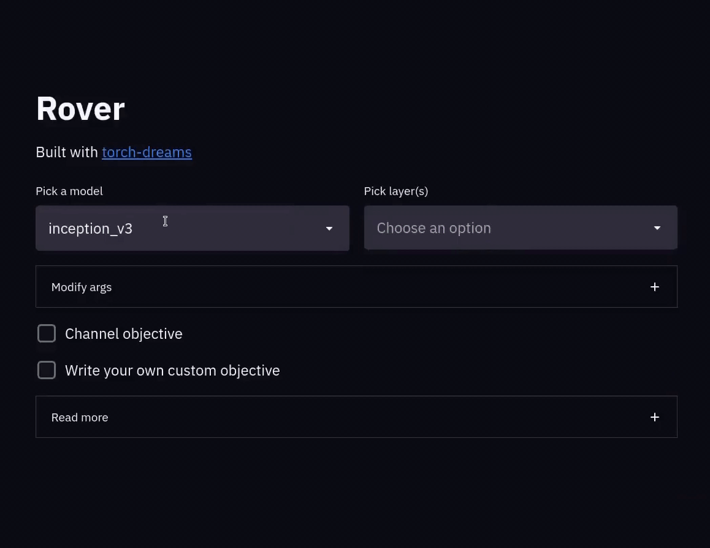

# :mag: Rover 
> Reverse engineer your CNNs, in style



Rover will help you break down your CNN and visualize the features from within the model. No need to write weirdly abstract code to visualize your model's features anymore. 

It supports pretty much any PyTorch model with an input of shape `[N, 3, H, W]` (even segmentation models/VAEs and all that fancy stuff) with imagenet normalization on input.

## :framed_picture: Channel objective

Optimizes a single channel from one of the layer(s) selected.

* **layer index**: specifies which layer you want to use out of the layers selected. 
* **channel index**: specifies the exact channel which needs to be visualized. 

## :mage_man: Writing your own objective

This is for the smarties who like to write their own objective function. The only constraint is that the function should be named `custom_func`.

Here's an example:

```python
def custom_func(layer_outputs):
    '''
    layer_outputs is a list containing 
    the outputs of each layer you selected

    In this example we'll try to optimize the following:
    * the entire first layer -> layer_outputs[0].mean()
    * 20th channel of the 2nd layer -> layer_outputs[1][20].mean()
    '''
    loss = layer_outputs[0].mean() + layer_outputs[1][20].mean()
    return -loss
```


## :computer: Args
* `width` (`int`, optional): Width of image to be optimized 
* `height` (`int`, optional): Height of image to be optimized 
* `iters` (`int`, optional): Number of iterations, higher -> stronger visualization
* `lr` (`float`, optional): Learning rate
* `rotate (deg)` (`int`, optional): Max rotation in default transforms
* `scale max` (`float`, optional): Max image size factor. 
* `scale min` (`float`, optional): Minimum image size factor. 
* `translate (x)` (`float`, optional): Maximum translation factor in x direction
* `translate (y)` (`float`, optional): Maximum translation factor in y direction
* `weight decay` (`float`, optional): Weight decay for default optimizer. Helps prevent high frequency noise. 
* `gradient clip` (`float`, optional): Maximum value of the norm of gradient. 


## Run locally

Clone the repo
```
git clone https://github.com/Mayukhdeb/rover.git
```

install requirements
```
pip install -r requirements.txt
```

showtime

```
streamlit run explore.py
```
